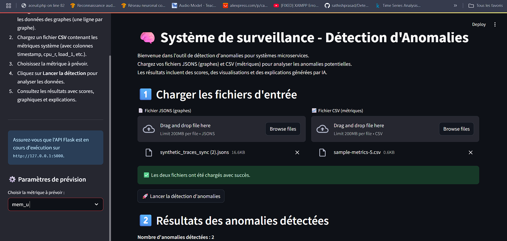
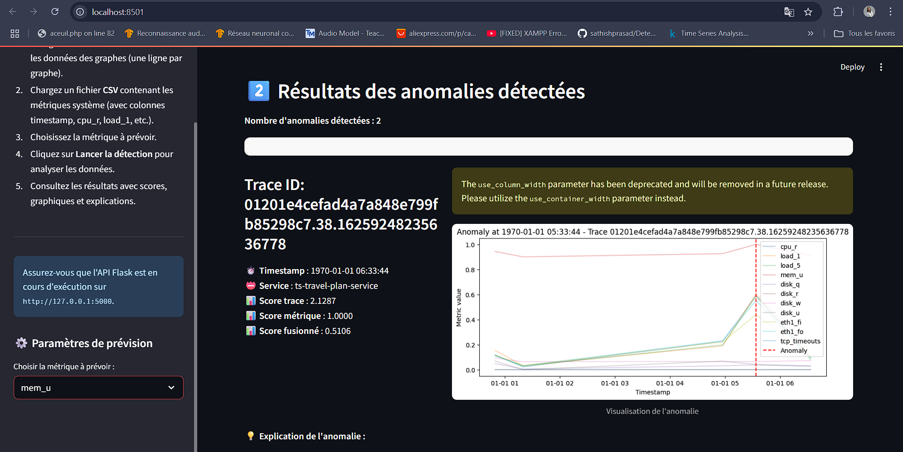
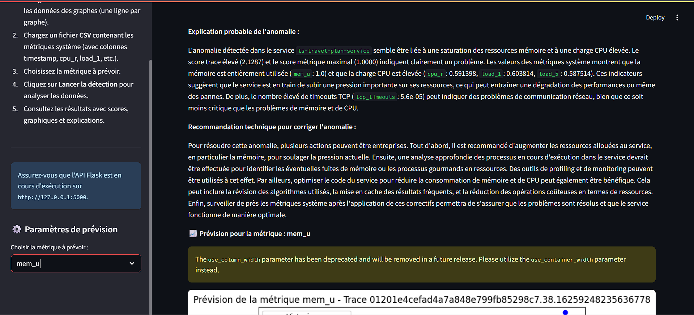
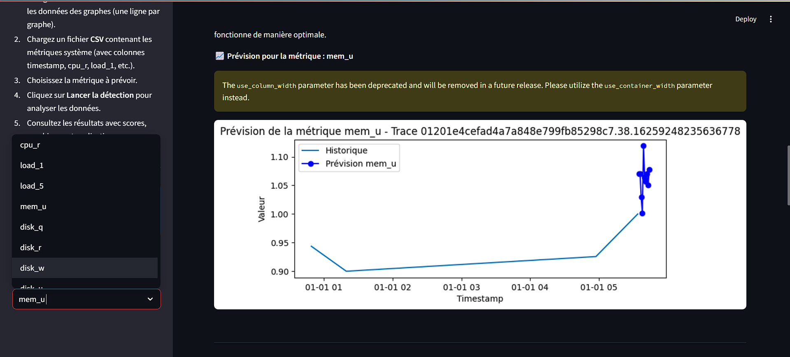
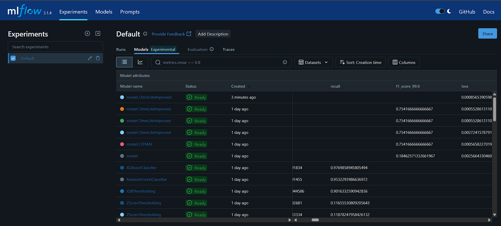

# 🔍 Détection d'Anomalies Multi-Sources et Explication Automatique dans les Systèmes Distribués

Ce dépôt propose un pipeline complet pour la détection d'anomalies et l'analyse de causes racines (RCA) dans des systèmes distribués, en s'appuyant sur des techniques de deep learning et de graphes, ainsi que sur des méthodes classiques d'anomaly detection sur métriques.

---

## 🗂️ Organisation du dépôt

```bash
|
├── cpu_anomaly_detection_univariate/
│   ├── CPU-anomaly-detection.ipynb      # Détection d'anomalies univariées sur la CPU (méthodes statistiques et ML)
│   └── anomaly-detection-autoencoder-cpu-util (1).ipynb # Détection d'anomalies CPU par autoencoder 
│
├── Metrics_detection_multivariate/
│   └── metrics-anomaly.ipynb            # Détection d'anomalies multivariées sur métriques système (Isolation Forest, Z-score, Autoencoder, LSTM, VAE, etc.)
│
├── DeepTralog/
│   ├── deeptralog_preprocesing.ipynb    # Prétraitement logs/traces, parsing, fusion, embeddings, construction des graphes, export format DeepTraLog
│   ├── eda-graphdata.ipynb              # Analyse exploratoire des graphes générés (EDA, statistiques, visualisations)
│   └── model-training.ipynb             # Entraînement et évaluation du modèle DeepTraLog (GGNN, DeepSVDD, métriques)
│
├── Visualisation/
│   ├── app_streamlit.py         # Interface utilisateur Streamlit
│   ├── app.py                  # API Flask pour l'inférence et l'explication
│
├── models/                     # Modèles entraînés, checkpoints, embeddings, scaler, etc.
│
├── demo.mp4                    # Vidéo de démonstration de l'interface
├── output.png                  # Exemple de graphe généré (prétraitement DeepTraLog)
├── DeepTraLog architecture.pdf          # Schéma d'architecture du modèle DeepTraLog
├── metric_anomaly.pdf                   # Présentation sur la détection d'anomalies sur métriques
├── README.md                            # Documentation du projet
```

---

## 📒 Description des notebooks principaux

### 1. **Détection d'anomalies sur métriques système**

- **cpu_anomaly_detection_univariate/CPU-anomaly-detection.ipynb**  
  Analyse univariée de séries temporelles CPU (AWS Cloudwatch) : Z-score, robust Z-score (MAD), IQR, Isolation Forest, LOF, One-Class SVM. Visualisations, confusion matrix, courbes ROC.

- **cpu_anomaly_detection_univariate/anomaly-detection-autoencoder-cpu-util (1).ipynb**  
  Approche autoencoder (Dense, Conv1D) pour la détection d'anomalies sur la CPU. Préparation des séquences, entraînement, visualisation des erreurs de reconstruction, comparaison avec les labels d'anomalie officiels.

- **Metrics_detection_multivariate/metrics-anomaly.ipynb**  
  Détection d'anomalies multivariées sur des métriques serveur (CPU, mémoire, disque, réseau, TCP).  
  - Prétraitement, sélection de features, analyse des corrélations.
  - Méthodes non supervisées : Isolation Forest (grid search), Z-score, robust Z-score (MAD), IQR.
  - Méthodes supervisées : Random Forest, XGBoost.
  - Deep learning : Autoencoder, LSTM, LSTM-VAE, OmniAI.
  - Visualisations, matrices de confusion, courbes ROC, analyse des performances.

---

### 2. **Pipeline DeepTraLog (logs + traces + graphes)**

- **DeepTralog/deeptralog_preprocesing.ipynb**  
  - Parsing avancé des logs (Drain), extraction TraceId/SpanId/Service.
  - Parsing et transformation des traces (spans) en événements structurés.
  - Fusion logs/traces, harmonisation, enrichissement des événements.
  - Génération d'embeddings sémantiques (TF-IDF + GloVe).
  - Construction des graphes orientés (TEG) pour chaque trace, typage des arêtes (sequence, sync/async).
  - Export des graphes et métadonnées au format officiel DeepTraLog (jsons/csv).

- **DeepTralog/eda-graphdata.ipynb**  
  - Analyse exploratoire des graphes générés : statistiques sur les nœuds, arêtes, types d'événements, distribution des labels.
  - Visualisation de sous-graphes, analyse des relations inter-services, typage des arêtes.

- **DeepTralog/model-training.ipynb**  
  - Chargement des graphes DeepTraLog, préparation des datasets (normal/anomalous).
  - Entraînement du modèle DeepTraLog (GGNN + DeepSVDD).
  - Évaluation des performances : MSE, F1-score, AUC, matrice de confusion, courbes ROC, analyse des scores d'anomalie.

---

### 3. **Autres dossiers et fichiers**

- **models/** : Modèles entraînés, checkpoints, fichiers de configuration pour la reproduction ou l'inférence.
- **DeepTraLog architecture.pdf** : Schéma d'architecture du modèle DeepTraLog.
- **metric_anomaly.pdf** : Présentation ou rapport sur la détection d'anomalies sur métriques.
- **output.png** : Exemple de sortie ou visualisation.
- **README.md** : Ce fichier de documentation.

---

## 🚀 Lancer la détection d'anomalies (Interface & API)

### 1. **API Flask (détection & explication LLM)**

L'API Flask (`Visualisation/app.py`) sert à :
- Charger le modèle GGNN+DeepSVDD et le modèle XGBoost métrique.
- Prendre en entrée des graphes (JSONS) et des métriques (CSV).
- Retourner les anomalies détectées, avec score, visualisation et explication générée par LLM (Mistral).

**Lancement :**
```bash
cd Visualisation
python app.py
```
L'API écoute sur `http://127.0.0.1:5000`.

### 2. **Interface utilisateur Streamlit**

L'interface Streamlit (`Visualisation/app_streamlit.py`) permet de :
- Charger vos fichiers JSONS (graphes) et CSV (métriques).
- Lancer la détection via l'API Flask.
- Visualiser les anomalies détectées, les scores, les graphiques et les explications/recommandations générées par LLM.

**Lancement :**
```bash
streamlit run Visualisation/app_streamlit.py
```
Ouvrez ensuite le lien local affiché dans votre navigateur.

---

## 🤖 Explication automatique par LLM & Prévision des métriques

Pour chaque anomalie détectée, deux IA sont utilisées :

- **Explication et recommandation par LLM (Mistral-medium)**  
  Un LLM (Mistral-medium) génère automatiquement une explication détaillée de la cause probable de l'anomalie et propose une recommandation technique concrète pour la corriger.  
  Le prompt inclut le service, les scores, les métriques système, et la réponse est affichée dans l'interface Streamlit.  
  > **Configuration** : renseignez votre clé API Mistral dans le fichier `.env` (`MISTRAL_API_KEY=...`).

- **Prévision des métriques avec Chronos-T5**  
  Pour chaque anomalie, une prévision (forecast) de la métrique sélectionnée (ex : cpu_r, disk_q, etc.) est générée automatiquement à l'aide du modèle Chronos-T5 small (Amazon).  
  Cela permet de visualiser l'évolution attendue de la métrique après l'anomalie, directement dans l'interface Streamlit.

---

## 📊 Résultats obtenus

Quelques scores typiques obtenus sur les jeux de données testés :

- **Détection univariée CPU (AE meilleur ) :**
  - F1-score : 0.82 
  - Précision : 0.77
  - Rappel : 0.78 
  - AUC : ~0.77

- **Détection multivariée (metrics-anomaly.ipynb) :**
  - Isolation Forest : Precision: 0.35 Recall: 0.71 F1-score: 0.47
  - Z_score: Precision: 0.65 Recall: 0.79  F1-score: 0.71
  - Autoencoder dense : Precision: 0.57 Recall: 0.60 F1-score: 0.58
  - LSTM : Precision: 0.76 Recall: 0.72 F1-score: 0.74
  - OmniAI : F1-score: 0.74 Recall: 0.73 Precision: 0.75 AUC: 0.95
  - XGBoost (supervisé) : Precision: 0.90 Recall: 0.97 F1-score: 0.93
  - Random Forest: Précision : 0.98 Recall : 0.95 F1-score : 0.97

- **DeepTraLog (GGNN + DeepSVDD sur graphes logs+traces) :**
   - Précision : 0.968
   - Recall: 0.673
   - F1-Score: 0.794 
   - AUC: 0.822

> Les résultats peuvent varier selon le dataset, le split et les hyperparamètres. Voir chaque notebook pour les détails et visualisations.

---

## 🛠️ Outils et requirements

### Outils principaux utilisés

- **Python 3.8+**
- **PyTorch**, **torch-geometric** (modèles graphes)
- **scikit-learn**, **xgboost** (modèles ML classiques)
- **TensorFlow/Keras** (autoencoders, LSTM)
- **Streamlit** (interface utilisateur)
- **Flask** (API backend)
- **MLflow** (tracking et comparaison des modèles)
- **MistralAI** (LLM pour explication automatique)
- **pandas**, **numpy**, **matplotlib**, **seaborn**, **plotly** (data science/visualisation)

### Installation des dépendances

```bash
pip install -r requirements.txt
```
---

## 🖼️ Démo & Visualisations

### 🎬 Démonstration vidéo

- [Voir la démo (demo_finale.mp4)](output/demo_finale.mp4)

### 📈 Exemples de visualisation

-   
  *Graphe orienté généré lors du prétraitement DeepTraLog (logs + traces fusionnés, typage des arêtes, couleurs par service).*

-   
  *Interface utilisateur pour l'analyse et l'explication des anomalies.*

  -   
  *Interface utilisateur pour detection d'anomalie.*

  -   
  *Interface utilisateur pour explication d'anomalie .*

 -   
  *Interface utilisateur pour forcasting métriques .*

-   
  *Suivi des scores et modèles via MLflow.*

---

## 🚦 Utilisation des notebooks et modèles

1. **Prétraitement et parsing :**
   - Exécuter `DeepTralog/deeptralog_preprocesing.ipynb` pour parser les logs/traces, fusionner, générer les embeddings et exporter les graphes au format DeepTraLog.

2. **Analyse exploratoire :**
   - Utiliser `DeepTralog/eda-graphdata.ipynb` pour explorer les graphes générés, vérifier la distribution des labels, des types d'arêtes, etc.

3. **Entraînement et évaluation :**
   - Lancer `DeepTralog/model-training.ipynb` pour charger les graphes, entraîner le modèle GGNN + DeepSVDD, et obtenir les métriques (F1, AUC, courbes ROC).
   - Les checkpoints sont sauvegardés dans le dossier `models/` (ex : `ggnn_Deep_svdd.pth`)

4. **Détection sur métriques :**
   - Pour la détection sur métriques système, utiliser les notebooks dans `cpu_anomaly_detection_univariate/` et `Metrics_detection_multivariate/`.

5. **Reprise d'un modèle entraîné :**
   - Charger le modèle et les paramètres sauvegardés (voir la dernière cellule de `model-training.ipynb` pour un exemple de chargement avec PyTorch).

---

## 📄 Références

- Article original : [Trace-Log Combined Microservice Anomaly Detection through Graph-based Deep Learning (ICSE 2022)](https://cspengxin.github.io/publications/icse22-DeepTraLog.pdf)
- Données : [DeepTraLog Dataset (GitHub)](https://github.com/FudanSELab/DeepTraLog)
- Dataset Multivariée pour les metriques (CPU,..) : [SMD dataset (GitHub)](https://github.com/snareli/Server-Machine-Dataset)

---
